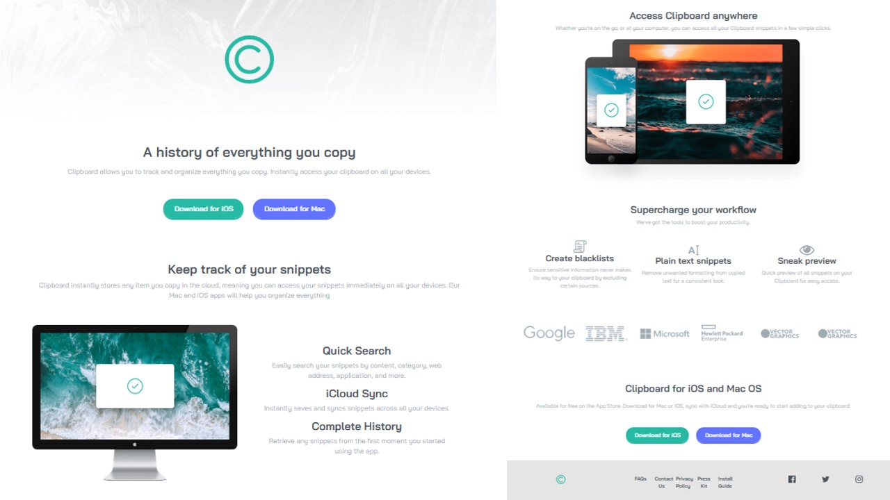

# Frontend Mentor - Clipboard landing page solution

This is a solution to the [Clipboard landing page challenge on Frontend Mentor](https://www.frontendmentor.io/challenges/clipboard-landing-page-5cc9bccd6c4c91111378ecb9). Frontend Mentor challenges help you improve your coding skills by building realistic projects. 

## Table of contents

- [Overview](#overview)
  - [The challenge](#the-challenge)
  - [Screenshot](#screenshot)
  - [Links](#links)
- [My process](#my-process)
  - [Built with](#built-with)
  - [What I learned](#what-i-learned)
  - [Continued development](#continued-development)
  - [Useful resources](#useful-resources)
- [Author](#author)
- [Acknowledgments](#acknowledgments)

## Overview

### The challenge

Users should be able to:

- View the optimal layout for the site depending on their device's screen size
- See hover states for all interactive elements on the page

### Screenshot

### Links

- Solution URL: [Add solution URL here](https://github.com/Lilitr09/Clipboard-Landing-Page)
- Live Site URL: [Add live site URL here](https://lilitr09.github.io/Clipboard-Landing-Page/)

## My process

### Built with

- Semantic HTML5 markup
- CSS custom properties
- Flexbox
- Bootstrap
- [Styled Components](https://uiverse.io/) - For styles

### What I learned

I learned a lot about layout and got to practice using the Bootstrap grid. However I did not quite managed to make the page fully responsive as I wanted to. I had a lot of troubles with images proportions and also with making the footer fully responsive. 

## Author

- Frontend Mentor - [@Lilitr09](https://www.frontendmentor.io/profile/Lilitr09)

